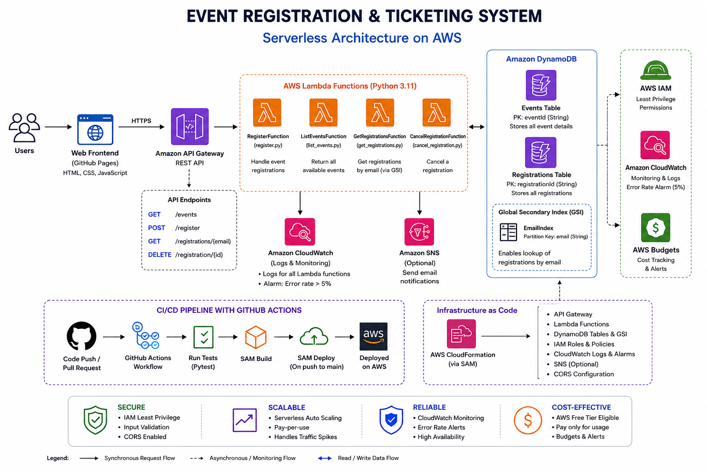

# Event Registration & Ticketing System

A serverless REST API built with **AWS SAM** that replaces Microsoft Forms +
Excel for event sign-ups. This README is written so you can hand it to
someone new to AWS and they can build the whole thing themselves, phase by
phase, exactly the way the project brief lays it out.

**Stack:** API Gateway → Lambda (Python 3.12) → DynamoDB, with CloudWatch
alarms, optional SNS email confirmations, and a GitHub Actions CI/CD pipeline.

---

## 0. Before you start — install these 3 things

| Tool | Why | Check it worked |
|---|---|---|
| [AWS CLI](https://docs.aws.amazon.com/cli/latest/userguide/getting-started-install.html) | talks to your AWS account | `aws --version` |
| [AWS SAM CLI](https://docs.aws.amazon.com/serverless-application-model/latest/developerguide/install-sam-cli.html) | builds & deploys this project | `sam --version` |
| Python 3.12 | the Lambda runtime we're using | `python3 --version` |

Then connect the CLI to your AWS account (use a free-tier / sandbox account
if you have one):
```bash
aws configure
# AWS Access Key ID, Secret Access Key, region (e.g. eu-west-1), output format (json)
```

---

## Project structure

```
event-registration-system/
├── template.yaml              # SAM template: defines EVERY AWS resource
├── src/handlers/
│   ├── register.py            # POST /register
│   ├── list_events.py         # GET /events
│   ├── get_registrations.py   # GET /registrations/{email}
│   ├── cancel_registration.py # DELETE /registration/{id}
│   └── utils/response.py      # shared response/CORS helper
├── scripts/seed_events.py     # adds 2 sample events after deploy
├── tests/test_handlers.py     # unit tests (mocked AWS, no real account needed)
├── .github/workflows/deploy.yml  # CI/CD pipeline
└── README.md                  # you are here
```

## Architecture diagram



## Web dashboard

The dependency-free dashboard in [frontend/](frontend/) is configured for
GitHub Pages and connects directly to the API Gateway endpoint.

- **Dashboard (after Pages deployment):** https://dorahowusu20001-ux.github.io/Event-ticketing-registration/
- **API base URL:** `https://zfxujvpipi.execute-api.us-west-1.amazonaws.com/dev`

Open the dashboard, paste the API base URL into **API Gateway URL**, then
select **Save & load**. To run it locally:

```powershell
python -m http.server 8080 --directory frontend
```

Open `http://localhost:8080`. The dashboard lets participants register, look
up registrations by email, view each registration's ID and attendee details,
and cancel a registration.

### GitHub Pages deployment

The [Pages workflow](.github/workflows/pages.yml) publishes `frontend/` when
changes are pushed to `main`. In the repository's **Settings → Pages**, set
the source to **GitHub Actions**; deployment status and the published URL are
available in the **Actions** tab.

---

## Phase 1: Infrastructure Foundation

**Goal:** understand *why* each piece exists before you deploy anything.

- **API Gateway** — the "front door". Turns HTTP requests into events that
  trigger Lambda functions.
- **Lambda** — your business logic, running only when called (no server to
  patch or pay for while idle).
- **DynamoDB** — a NoSQL table. We use two: `Events` and `Registrations`.
- **IAM** — every Lambda function gets *only* the permissions it needs
  (e.g. the function that lists events can only *read* the Events table,
  never write or delete). This is the "principle of least privilege."

All of this is declared in **`template.yaml`** — one file, the whole
infrastructure. Open it and read through the `Resources:` section; every
AWS service in the diagram from the brief maps to a block in there.

Table design:
- `Events` table → key: `eventId` (string)
- `Registrations` table → key: `registrationId` (string), plus a
  **Global Secondary Index** on `email` so `GET /registrations/{email}` is a
  fast, cheap *query* instead of a full table *scan*.

---

## Phase 2: API Development

The 4 endpoints from the brief are already implemented in `src/handlers/`:

| Method | Path | File | What it does |
|---|---|---|---|
| POST | `/register` | `register.py` | validates email, confirms event exists, writes registration |
| GET | `/events` | `list_events.py` | scans + returns all events, sorted by date |
| GET | `/registrations/{email}` | `get_registrations.py` | queries the EmailIndex GSI |
| DELETE | `/registration/{id}` | `cancel_registration.py` | deletes one registration, 404 if it's already gone |

Each handler:
- validates its inputs before touching DynamoDB
- returns clean JSON with proper HTTP status codes (400/404/500) via the
  shared `utils/response.py` helper
- includes CORS headers so a web frontend can call it directly

### Build & deploy it

```bash
cd event-registration-system
sam build
sam deploy --guided
```

`--guided` walks you through naming the stack, picking a region, and saving
those choices to `samconfig.toml` so future deploys are just `sam deploy`.
When it finishes, copy the `ApiUrl` value from the Outputs — that's your
base URL for everything below.

### Seed sample events

```bash
# grab the real table name from your stack outputs, then:
python scripts/seed_events.py events-dev
```

### Try it with curl

```bash
# List events
curl https://YOUR_API_URL/events

# Register
curl -X POST https://YOUR_API_URL/register \
  -H "Content-Type: application/json" \
  -d '{"eventId":"evt-001","email":"friend@example.com","name":"Kwame"}'

# View a person's registrations
curl https://YOUR_API_URL/registrations/friend@example.com

# Cancel (use the registrationId returned above)
curl -X DELETE https://YOUR_API_URL/registration/REGISTRATION_ID
```

---

## Phase 3: Automation & CI/CD

`.github/workflows/deploy.yml` does two things:

1. **On every push/PR** → installs deps, runs `pytest tests/` (these use
   `moto` to fake AWS, so no real credentials or costs are involved).
2. **On push to `main` only** → runs `sam build` + `sam deploy` for real.

To wire this up in your own GitHub repo:

1. Create an IAM role AWS can assume via GitHub's OIDC provider (avoids
   storing long-lived AWS keys as secrets — this is the current best
   practice; ask if you want the exact IAM trust policy for this).
2. Add two repo secrets: `AWS_DEPLOY_ROLE_ARN` and `AWS_REGION`.
3. Push to `main` — check the **Actions** tab to watch it run.

Branching strategy for a small team: work on feature branches, open a PR
into `main` (this triggers the *test* job only), merge once green (this
triggers *test + deploy*).

---

## Phase 4: Monitoring & Security

Already built into `template.yaml`:

- **CloudWatch Logs** — every Lambda invocation is logged automatically
  under `/aws/lambda/<function-name>`.
- **CloudWatch Alarm** — `RegisterErrorRateAlarm` uses a metric-math
  expression (`Errors / Invocations * 100`) to fire when the error rate
  passes **5%**, matching the brief exactly. You can duplicate this alarm
  block for the other 3 functions the same way.
- **Input validation** — every handler rejects malformed input (bad email,
  missing fields) *before* it reaches DynamoDB.
- **Least privilege IAM** — look at the `Policies:` under each function in
  `template.yaml`; each one only grants exactly what that function touches.
- **SNS confirmation emails** (optional) — deploy with
  `sam deploy --parameter-overrides Stage=dev NotificationEmail=you@example.com`
  and you'll get an email to confirm the subscription, then a confirmation
  email on every registration and an alert if the error alarm fires.

**AWS Budgets** (manual, one-time, console or CLI — not part of SAM):
```bash
aws budgets create-budget --account-id YOUR_ACCOUNT_ID --budget file://budget.json
```
Simplest path for a student project: AWS Console → Billing → Budgets →
"Create a budget" → Zero spend budget → alert at $1.

---

## Phase 5: Deployment and Optimization

The application is deployed using AWS SAM, with GitHub Actions supporting the CI/CD process.

- **Cost:** The project uses serverless AWS services such as Lambda, API Gateway, DynamoDB, and CloudWatch. For a small class project, usage is expected to remain low, subject to AWS Free Tier limits and actual usage.
- **Resource lifecycle:** CloudWatch log retention is configured for 14 days using `AllFunctionsLogGroupRetention` so that logs do not accumulate indefinitely.
- **Tearing down resources:** When the project is no longer needed, the SAM stack can be removed using:

  ```bash
  sam delete

This removes the resources created by the SAM stack.

Deliverables Checklist
 GitHub repository with API code
 CI/CD pipeline using GitHub Actions
 Lambda functions
 DynamoDB table definitions
 CloudWatch alarms configuration
 README documentation
 Product presentation — problem, challenges, and demo
---

## Running tests locally (do this first, before any AWS deploy)

```bash
pip install -r tests/requirements-test.txt
pytest tests/ -v
```

All 5 tests should pass — they cover successful registration, an
unknown-event rejection, invalid-email rejection, listing events, and the
full register → look-up → cancel → cancel-again(404) flow. Green tests here
mean your business logic is correct *before* you spend a single AWS credit.

## Troubleshooting

- **`sam build` fails on imports** — make sure you're running it from the
  project root (where `template.yaml` lives).
- **403/permissions errors in Lambda logs** — check the `Policies:` block
  for that function in `template.yaml`; it may be missing a permission.
- **CORS errors from a browser** — confirm your frontend is hitting the
  exact `ApiUrl` from `sam deploy` output, including the `/dev` (or your
  stage name) prefix.
