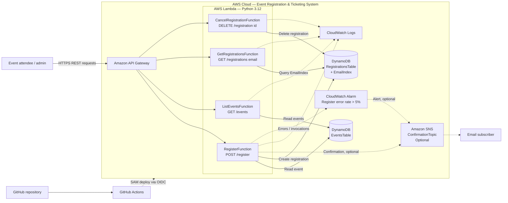

# Architecture Diagram Guide

Use this document as the blueprint for a draw.io architecture diagram of the
Event Registration & Ticketing System.

## Skeleton architecture diagram

## Recommended diagram layout

Arrange the diagram from left to right in five grouped areas:

1. **Users and delivery** — Event attendee/admin, GitHub repository, and GitHub
   Actions.
2. **API layer** — Amazon API Gateway (REST API).
3. **Application layer** — four AWS Lambda functions running Python 3.12.
4. **Data and notifications** — two DynamoDB tables and an optional SNS topic
   with an email subscription.
5. **Observability** — Amazon CloudWatch Logs and the registration error-rate
   alarm.

Put all AWS services inside a single boundary labelled:

`AWS Cloud — Event Registration & Ticketing System (<Stage>)`

Use official AWS Architecture icons in draw.io where available. Use solid
arrows for request/data flows and dashed arrows for monitoring, alerting, and
deployment flows.

## Components to draw

| Group | Component label | Notes |
|---|---|---|
| User | Event attendee / admin | Calls the REST API from a browser, app, or API client. |
| Delivery | GitHub repository | Stores source code, SAM template, tests, and workflow. |
| Delivery | GitHub Actions | Tests every push/PR; deploys from `main`. |
| API | Amazon API Gateway | Public REST API; enables CORS. |
| Compute | `RegisterFunction` | `POST /register` |
| Compute | `ListEventsFunction` | `GET /events` |
| Compute | `GetRegistrationsFunction` | `GET /registrations/{email}` |
| Compute | `CancelRegistrationFunction` | `DELETE /registration/{id}` |
| Data | `EventsTable` | DynamoDB; partition key: `eventId`. |
| Data | `RegistrationsTable` | DynamoDB; partition key: `registrationId`. |
| Data | `EmailIndex` | DynamoDB global secondary index on `RegistrationsTable`; partition key: `email`. |
| Notifications | `ConfirmationTopic` | Optional SNS topic, created only when `NotificationEmail` is set. |
| Notifications | Email subscriber | Receives registration confirmations and alarm alerts. |
| Monitoring | CloudWatch Logs | Receives logs from all four Lambda functions. |
| Monitoring | `RegisterErrorRateAlarm` | Fires when RegisterFunction's error rate exceeds 5%. |

## Connections and arrow labels

Draw the following numbered flows. Keeping these labels on the arrows makes
the diagram self-explanatory.

### Runtime API flow

1. **Event attendee/admin → API Gateway**: `HTTPS REST request`
2. **API Gateway → RegisterFunction**: `POST /register`
3. **API Gateway → ListEventsFunction**: `GET /events`
4. **API Gateway → GetRegistrationsFunction**: `GET /registrations/{email}`
5. **API Gateway → CancelRegistrationFunction**: `DELETE /registration/{id}`
6. **API Gateway → Event attendee/admin**: `JSON response`

### Lambda data flow

7. **RegisterFunction → EventsTable**: `Read event / verify eventId`
8. **RegisterFunction → RegistrationsTable**: `Create registration`
9. **ListEventsFunction → EventsTable**: `Read events`
10. **GetRegistrationsFunction → EmailIndex**: `Query by email`
11. **EmailIndex → RegistrationsTable**: `Index on registrations`
12. **CancelRegistrationFunction → RegistrationsTable**: `Delete registration`

### Notification and monitoring flow

13. **RegisterFunction → ConfirmationTopic**: `Publish registration confirmation (optional)`
14. **ConfirmationTopic → Email subscriber**: `Email notification`
15. **All Lambda functions → CloudWatch Logs**: `Invocation logs`
16. **RegisterFunction → RegisterErrorRateAlarm**: `Errors and invocations metrics`
17. **RegisterErrorRateAlarm → ConfirmationTopic**: `Alarm notification (optional)`

### CI/CD deployment flow

18. **Developer → GitHub repository**: `Push / pull request`
19. **GitHub repository → GitHub Actions**: `Trigger workflow`
20. **GitHub Actions → AWS Cloud**: `OIDC role assumption; SAM build and deploy`
21. **GitHub Actions → API Gateway, Lambda, DynamoDB, SNS, CloudWatch**: `CloudFormation/SAM deployment`

## Visual hierarchy

- Make **API Gateway** the central entry point and position the four Lambda
  functions directly beneath or to its right.
- Put **EventsTable** beside `ListEventsFunction` and `RegisterFunction`.
- Put **RegistrationsTable** beside `RegisterFunction` and
  `CancelRegistrationFunction`, with **EmailIndex** attached to it and close to
  `GetRegistrationsFunction`.
- Put SNS and its email subscriber at the far right; use a small `Optional`
  badge because the topic is conditional.
- Put CloudWatch below the Lambda row, using dashed monitoring arrows.
- Keep GitHub and GitHub Actions outside the AWS Cloud boundary, above the
  runtime request path.

## Suggested diagram title and legend

**Title:** `Serverless Event Registration & Ticketing System Architecture`

**Legend:** solid arrow = runtime data/request flow; dashed arrow = deployment,
monitoring, or alerting flow; optional badge = resource created only when a
notification email is configured.
